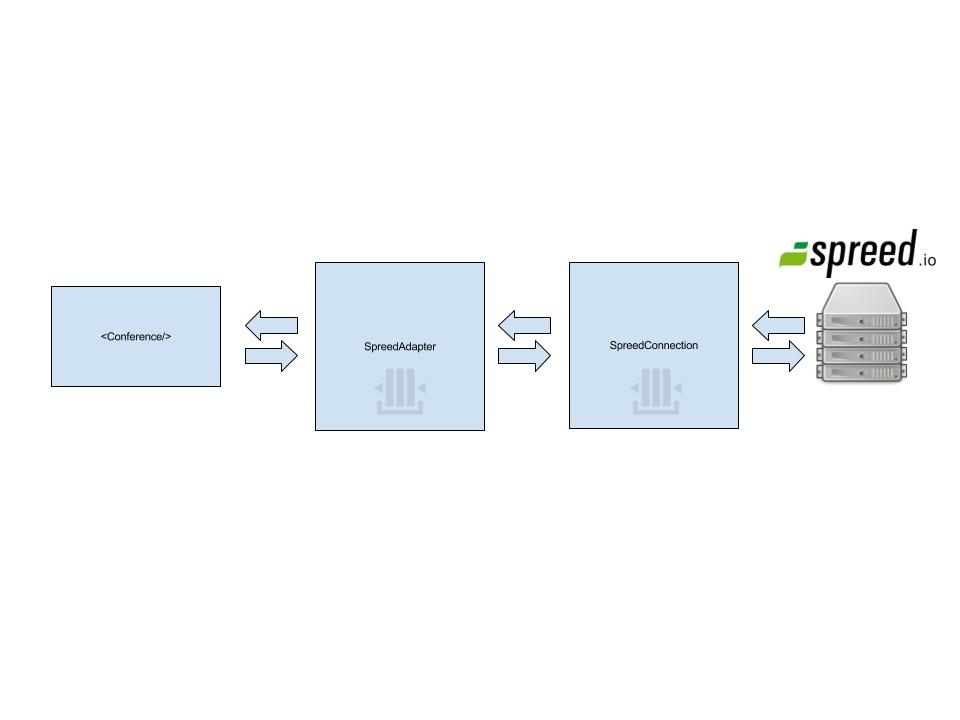

# Design

react-conf-webrtc is designed to be flexible enough to support your signaling system. In order to accomplish this
react-conf-webrtc uses an event system with well-defined messages that you can send and expect to receive.

Out of the box, react-conf-webrtc ships with an adapter for the Spreed RTC signaling events. This adapter acts
as a middleman between the Spreed WebSocket server events and the conference room and translates them to be
compatible with the react-conf-webrtc API and vice versa.

The SpreedAdapter internally will queue the messages if there are no messages available. This is necessary because
of the delay between connecting to the server and the initialization of the react-conf-webrtc component.

In addition to the SpreedAdapter class, react-conf-webrtc ships with a SpreedConnection class. The SpreedConnection
class is a wrapper around the WebSocket connection. Just like the SpreedAdapter, the SpreedConnection will queue messages
until a receiver is available to consume the messages. The SpreedConnection deserializes any incoming messages before passing
them to the receiver.

For outgoing messages, the SpreedAdapter will integrate with a SpreedMessager class that will know the contract
of the Spreed API. The SpreedMessager class is only responsible for creating Spreed compatible messages. It is the
responsibility of the SpreedAdapter to orchestrate and send the messages to the SpreedConnection.

If you find that the default adapter needs to be extended/modified you can create your own
adapter class that handles specific events and proxies all other events. Likewise, you can
use composition to create your own SpreedMessager class in order to accomodate your modified
version of the Spreed API.

# SpreedAdapter Design



## Example

This example is meant to illustrate how you can integrate the different pieces to
create a Spreed + react-web-rtc conference.

```tsx
import * as React from 'react'
import { Conference, connectToSpreed, Connection } from 'react-conf-webrtc';

export class App extends React.Component<{}, {}> {
    private connect(): Connection {
        return connectToSpreed();
    }

    render() {
        return (
            <Conference room='main' connect={this.connect}/>
        );
    }
}
```

The first important interface to understand is the `Connection` interface. The Connection
interface allows us to return any implementation of connection:

```ts
interface Connection {
    subscribe: (subscriber: (message: MessageIncoming): void): void
    publish: (message: MessageOutgoing): void;
}
```

The Connection interface has only two methods: `subscribe` and `publish`. When the conference room calls the connect prop,
it will keep a reference to the return object and subscribe to it. This is how the Connection should signal events to the Conference room.

Likewise, when the Conference room needs to communicate with the Connection, it will use the `publish` method. The publish method
let's the conference room publish it's events for the consumer to listen and react to.

Note that the examples uses a `connectToSpreed()` method to get a connection. It is a convenience method for wiring up a
`SpreedConnection` and `SpreedAdapter` object.

Inside of the Conference room this is what is roughly happening:

```tsx
import * as React from 'react';
import { Connection } from '../data'

export interface IProps {
    connect: () => Connection;
    room: string;
}

export class Conference extends React.Component<IProps, IState> {
    private connection: Connection;

    constructor() {
        super();
        this.connection = this.props.connect();
        this.connection.subscribe(this.handleIncomingMessage);
        this.joinRoom(this.props.room);
    }

    private handleIncomingMessage(msg: MessageIncoming) {
        switch (msg.type) {
            // Do WebRTC business logic
        }
    }

    private sendMessage(msg: MessageOutgoing) {
        this.connection.publish(msg);
    }
}
```

### Managing the connection lifecycle

The Conference exposes an API for managing the lifecycle of the connection. For example, in Jingoal's backend architecture, the life of a connection only exists for one room. If you change rooms,
you may be required to connect to a different server. This presents a problem because the Conference room only calls the `connect` method once in order to establish a connection.

In order to accomodate as many scenarios as possible, the Conference room exposes a connection lifecycle API. For example, if you must establish a new connection you can send a NEW_CONNECTION event to the
Conference room and it will take care of establishing a new connection.

